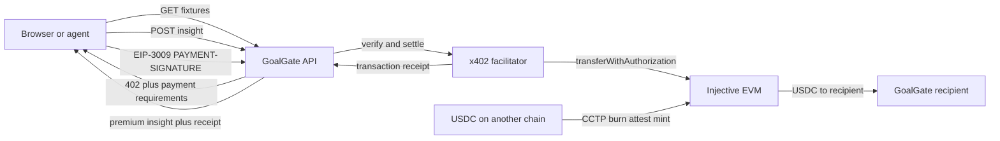

# GoalGate

GoalGate is a football intelligence service where fixtures are free and a caller pays exactly `0.01 USDC` for one premium tactical answer. The payment is part of the HTTP request through x402, settles on Injective EVM, and returns an onchain transaction receipt. The same API is callable by the browser app, ordinary HTTP clients, MCP clients, and autonomous agents.

Live app: [goal-gate-beta.vercel.app](https://goal-gate-beta.vercel.app)

## The problem

Useful match intelligence is usually trapped behind accounts, recurring subscriptions, shared API keys, or large data contracts. Those models are awkward for a fan who wants one answer and even worse for an autonomous agent that cannot complete a signup flow or safely share a long-lived credential.

GoalGate makes premium football analysis purchasable one request at a time. A caller discovers the price over normal HTTP, signs a narrowly scoped USDC authorization, and receives the answer only after the payment has been verified and settled.

## What GoalGate does

- Publishes a free match feed for discovery and UI browsing.
- Protects `POST /api/v1/insights` with an x402 v2 payment challenge.
- Prices each premium answer at `10,000` USDC base units, or `0.01 USDC`.
- Uses native USDC on Injective EVM testnet and EIP-3009 authorization signatures.
- Returns the settlement transaction hash and an Injective explorer URL.
- Publishes x402 discovery metadata at `/.well-known/x402.json`.
- Exposes match, network, paid-insight, and CCTP configuration tools through MCP.
- Includes a reusable GoalGate agent skill with explicit payment-consent rules.

## Current status, honestly

The website and API are publicly deployed. The fixture feed is currently seeded demo data, not yet connected to a licensed live World Cup data provider. Development mode supports a clearly labeled `demo` receipt so the interface can be exercised without funds.

Production never accepts a demo payment. It fails closed with HTTP `503` until a valid recipient wallet and either a remote or embedded facilitator are configured. A transaction is only described as onchain when the facilitator returns a successful settlement and transaction hash.

Injective's official x402 package supports testnet, but Injective's public launch announcement currently guarantees its hosted facilitator on mainnet. The hostname referenced by the package notes, `x402.injective.network`, did not resolve when verified on July 11, 2026. GoalGate therefore does not ship that dead URL as a default. For testnet, use the official package's embedded facilitator as described below, or set `X402_FACILITATOR_URL` only after verifying a compatible service.

## Architecture



The static product UI and documentation are served by Vercel. `api/handler.js` is the serverless production API. `server.js` provides the same routes for local development. Shared Injective network, CCTP, payment-challenge, decoding, verification, and settlement logic lives in `lib/injective.js`.

## How x402 is used

1. The client calls `POST /api/v1/insights` with a valid match and question.
2. GoalGate returns HTTP `402` with a Base64 `PAYMENT-REQUIRED` header.
3. The challenge specifies the exact scheme, `eip155:1439`, native USDC, `0.01 USDC`, expiry, and recipient.
4. The client signs an EIP-3009 authorization and retries with `PAYMENT-SIGNATURE`.
5. GoalGate decodes the x402 v2 payload with `@injectivelabs/x402` and sends the structured request to the facilitator.
6. The facilitator verifies the signature, submits `transferWithAuthorization`, pays INJ gas, and waits for confirmation.
7. GoalGate releases the insight and returns `PAYMENT-RESPONSE`, the transaction hash, and an explorer URL.

The payer never sends a private key to GoalGate. The signature authorizes only the quoted token, amount, recipient, nonce, and validity window.

## How CCTP is used

Native USDC on Injective is issued through Circle CCTP. GoalGate exposes the official destination domain and contracts at `GET /api/v1/funding/cctp`, allowing a wallet or agent to prepare a burn, attestation, and mint flow from another supported chain before paying an x402 request.

The current endpoint is configuration and discovery, not custody: GoalGate does not hold funds, fabricate bridge receipts, or claim that a CCTP transfer occurred. A wallet-executed CCTP funding screen is the next production integration step.

## Official Injective testnet configuration

| Item | Value |
| --- | --- |
| EVM chain ID | `1439` |
| CAIP-2 network | `eip155:1439` |
| RPC | `https://k8s.testnet.json-rpc.injective.network/` |
| Explorer | `https://testnet.blockscout.injective.network` |
| Native USDC | `0x0C382e685bbeeFE5d3d9C29e29E341fEE8E84C5d` |
| CCTP domain | `29` |
| TokenMessengerV2 | `0x8FE6B999Dc680CcFDD5Bf7EB0974218be2542DAA` |
| MessageTransmitterV2 | `0xE737e5cEBEEBa77EFE34D4aa090756590b1CE275` |
| TokenMinterV2 | `0xb43db544E2c27092c107639Ad201b3dEfAbcF192` |

Sources: [Injective USDC and CCTP documentation](https://docs.injective.network/developers-defi/usdc-stablecoin) and [Injective x402 documentation](https://docs.injective.network/developers-ai/x402).

## Run locally

```bash
npm install
npm start
```

Open `http://localhost:4173`. When `NODE_ENV` is not `production`, `PAYMENT-SIGNATURE: demo` unlocks the development flow and the response is explicitly marked with `demo: true`.

Run the tests with:

```bash
npm test
```

## Production environment

Copy `.env.example` into the deployment environment. You must supply your own recipient:

```dotenv
X402_PAY_TO=0xYOUR_INJECTIVE_EVM_RECIPIENT
```

Choose one facilitator mode:

```dotenv
# A verified x402 v2 facilitator that supports eip155:1439
X402_FACILITATOR_URL=https://your-facilitator.example
```

Or use the official Injective package's embedded facilitator with a dedicated testnet-only hot wallet:

```dotenv
X402_FACILITATOR_PRIVATE_KEY=0xTESTNET_ONLY_PRIVATE_KEY
X402_FACILITATOR_URL=
```

The embedded facilitator address must hold testnet INJ for settlement gas. Never use a personal wallet key, commit the key, expose it to the browser, or reuse a testnet facilitator key on mainnet. Use Vercel encrypted environment variables or a production secrets manager.

After setting `X402_PAY_TO` in Vercel, redeploy:

```bash
vercel env add X402_PAY_TO production
vercel --prod
```

## API surface

| Route | Access | Purpose |
| --- | --- | --- |
| `GET /api/health` | Free | Service and payment-configuration status |
| `GET /api/v1/network` | Free | Injective testnet RPC status |
| `GET /api/v1/matches` | Free | Match feed |
| `GET /api/v1/funding/cctp` | Free | Official CCTP destination configuration |
| `POST /api/v1/insights` | `0.01 USDC` | Premium tactical answer |
| `GET /api/openapi.json` | Free | OpenAPI description |
| `GET /.well-known/x402.json` | Free | Machine-readable x402 discovery |

## MCP and agent skill

Run `npm run mcp` to start the stdio MCP server. It exposes fixture discovery, paid insight requests, Injective network status, and CCTP funding configuration. The workflow in `skills/goalgate-agent/SKILL.md` requires explicit user authorization before a wallet signs and never describes a development receipt as an onchain transaction.

## Production roadmap

- Connect a licensed World Cup fixture, event, lineup, and statistics provider.
- Complete and test one real Injective testnet settlement with a public explorer receipt.
- Add a wallet-executed Circle CCTP funding flow.
- Add durable rate limiting, request analytics, replay monitoring, and facilitator health alerts.
- Move the facilitator key to managed KMS before any mainnet release.
